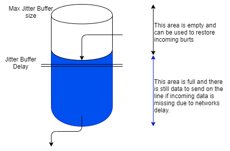
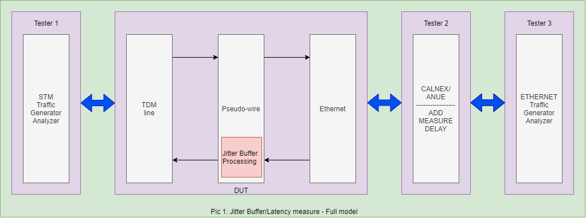
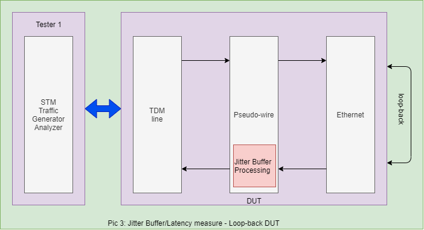
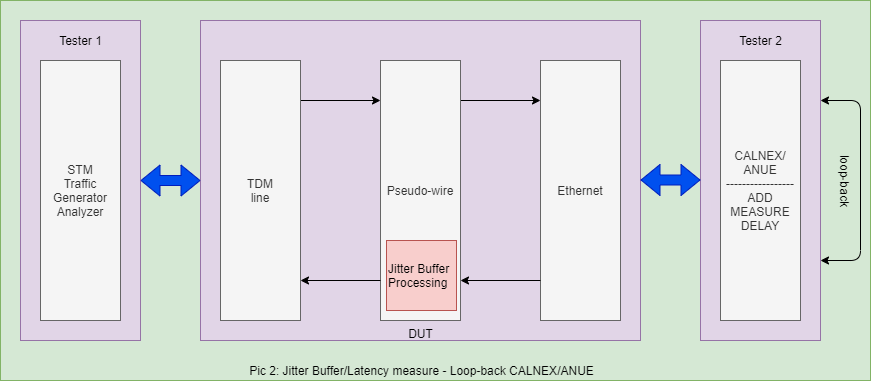

<!-- TOC depthFrom:1 depthTo:6 withLinks:1 updateOnSave:1 orderedList:0 -->
- [Abstract](#abstract)
- [Terminology](#terminology)
- [Scope](#scope)
- [References](#references)
- [Compliance Levels](#compliance-levels)
- [Test Status Definitions](#test-status-definitions)
- [Introduction](#introduction)
	- [Pseudo-wire payload size supported range](#pseudo-wire-payload-size-supported-range)
		- [OCN cards](#ocn-cards)
		- [DS3/E3 card](#ds3e3-card)
		- [DS1/E1 card](#ds1e1-card)
	- [Payload size and Jitter buffer dependency](#payload-size-and-jitter-buffer-dependency)
		- [OCN cards](#ocn-cards)
		- [DS3/E3 card](#ds3e3-card)
		- [DS1/E1 card](#ds1e1-card)
- [Test Configuration for "Jitter Buffer latency"](#test-configuration-for-jitter-buffer-latency)
- [Test Case Template for "Jitter Buffer latency"](#test-case-template-for-jitter-buffer-latency)
- [Test cases for change PayloadSize](#test-cases-for-change-payloadsize)
	- [Test cases for change PayloadSize: Change Under size](#test-cases-for-change-payloadsize-change-under-size)
	- [Result testing](#result-testing)
	- [Test cases for change PayloadSize: Change Over size](#test-cases-for-change-payloadsize-change-over-size)
	- [Result testing](#result-testing)
	- [Test cases for change PayloadSize: Change In-range](#test-cases-for-change-payloadsize-change-in-range)
	- [Result testing](#result-testing)
- [Test cases for change Jitter buffer](#test-cases-for-change-jitter-buffer)
	- [Test cases for change Jitter buffer: Change Under size](#test-cases-for-change-jitter-buffer-change-under-size)
	- [Result testing](#result-testing)
	- [Test cases for change Jitter buffer: Change Over size](#test-cases-for-change-jitter-buffer-change-over-size)
	- [Result testing](#result-testing)
	- [Test cases for change Jitter buffer: Change In-range](#test-cases-for-change-jitter-buffer-change-in-range)
	- [Result testing](#result-testing)
- [Test cases for force/generator Jitter tolerance from TDM tester](#test-cases-for-forcegenerator-jitter-tolerance-from-tdm-tester)
	- [Result testing](#result-testing)
- [Test cases for force/measure delay from CALNEX/ANUE tester](#test-cases-for-forcemeasure-delay-from-calnexanue-tester)
	- [Test cases for force/measure delay from CALNEX/ANUE tester: Anue cfg Constance Delay](#test-cases-for-forcemeasure-delay-from-calnexanue-tester-anue-cfg-constance-delay)
	- [Result testing](#result-testing)
	- [Test cases for force/measure delay from CALNEX/ANUE tester: Increase Constance Delay](#test-cases-for-forcemeasure-delay-from-calnexanue-tester-increase-constance-delay)
		- [Test Procedure](#test-procedure)
	- [Result testing](#result-testing)
	- [Test cases for force/measure delay from CALNEX/ANUE tester: Decrease Constance Delay](#test-cases-for-forcemeasure-delay-from-calnexanue-tester-decrease-constance-delay)
		- [Test Procedure](#test-procedure)
	- [Result testing](#result-testing)
	- [Test cases for force/measure delay from CALNEX/ANUE tester: Force drop packet/In range](#test-cases-for-forcemeasure-delay-from-calnexanue-tester-force-drop-packetin-range)
		- [Test Procedure](#test-procedure)
	- [Result testing](#result-testing)

<!-- /TOC -->
# Abstract
This document defines test procedures for testing and certification of `Payload/Jiter buffer`
The test cases are based on requirements defined in `"Arrive_PWE_CodeChip_Payloadsize_And_Jitterbuffer_Rev1.2"` document.

# Terminology

| Acronym | Meaning |
| ------ | ------ |
| DUT | Device Under Test |
| PW  |         Pseudo-wire|
|SDH          |Synchronous Digital Hierarchy|
|SONET        |Synchronous Optical Network|
|TDM          |Time Division Multiplexing|

# Scope

The Abstract Test Suite for Jitter/Buffer latency describes test procedures based on requirements defined in `G823` and `Arrive_PWE_CodeChip_Payloadsize_And_Jitterbuffer_Rev1.2`.

An overview of the different groups of tests for `Jitter/Buffer latency` is provided as follows:
  * Test cases for `change PayloadSize`
  * Test cases for `change Jitter Buffer/Delay`
  * Test cases for `force/generator Jitter tolerance from TDM tester`
  * Test cases for `force/measure delay from CALNEX/ANUE tester`

# References

| Standard | Meaning |
| ------ | ------ |
| [RFC4553][RFC4553] | Structure-Agnostic Time Division Multiplexing (TDM)  over Packet (SAToP)|
| [RFC5086][RFC5086] | Structure-Agnostic Time Division Multiplexing (TDM) Circuit Emulation Service over Packet Switched Network (CESoPSN)|
| [RFC4842][RFC4842] | Synchronous Optical Network/Synchronous Digital Hierarchy (SONET/SDH) Circuit Emulation over Packet (CEP)
| [G823][G823]    | The control of jitter and wander within digital networks which are based on the 2048 kbit/s hierarchy  |

# Compliance Levels

The key words **"MUST"**, **"MUST NOT"**, **“REQUIRED”**, **“SHALL”**, **“SHALL NOT”**, **“SHOULD”**, **“SHOULD NOT”**, **“RECOMMENDED”**, **“MAY”**, and **“OPTIONAL”** in this document are to be interpreted as described in [RFC 2119][RFC 2119]. All key words **MUST** be use upper case, bold text.

# Test Status Definitions

MANDATORY status: This means that a test case **MUST** be executed because it verifies an absolute requirement or an absolute requirement dependent on an optional feature. If the requirement is absolute the test must be executed. If the requirement is absolute but dependent on an optional feature and that feature is supported, the test case must be executed. If the optional feature is not supported, the test case is not executed and it is declared as “not applicable”.

OPTIONAL status: This word means that a test case **MAY** or **MAY NOT** be executed because it verifies a requirement that is not absolute. The decision to execute such a test case will usually depend on the ability to support a particular feature that is not tied to an absolute requirement. If such a test case is not executed it is declared as “not applicable”.

# Introduction

## Pseudo-wire payload size supported range

Pseudo-wire payload size is configured in number of bytes in case of SAToP and CEP or number of DS1/E1 frame in case of CESoP. In the case of CESoP, payload size in bytes is calculated by number of DS0 slots in encapsulating NxDs0 multiplied with number of DS1/E1 frame configured for Pseudo-wire:

**`CESoP payload size in bytes = N * Number of DS1/E1 frames`**

**Where**: `N is number of DS0 slots in encapsulating NxDs0`

Minimum payload size in byte for each product and service is listed below.

Maximum payload size in byte of Pseudo-wire depends on how many bytes Ethernet header occupies in entire Ethernet packet and the maximum transmit unit (MTU) supported for each kind of service. Ethernet header includes DA, SA, Ethernet type, VLAN tags and PSN header (MPLS, UDP-IPv4, UDP-IPv6, …).

MTU is computed by Pseudo-wire payload plus Ethernet header. MTU for each product and service is also listed in below table.
For example, let calculate maximum Pseudo-wire payload size for OCN card in case of DS3 SAToP service running with MPLS 1 label and 1 VLAN tag.

**Ethernet header bytes** = `DA + SA + Ethernet type (2 bytes) + Vlan tag (4 bytes) + MPLS label (4 bytes) = 22 bytes`

**Maximum payload size** = `2048 – 22 = 2026 bytes`

### OCN cards

|Services |Minimum payload size in bytes |MTU (Note 2) |
| ------ | ------ | ------ |
|CESoP 8 |(Note 1)| 2048|
|DS1 SAToP |64| 2048|
|E1 SAToP| 64| 2048|
|E3SAToP| 256| 2048|
|DS3SAToP| 256| 2048|
|VC11/VT1.5| CEP| 104| 2044|
|VC12/VT-2| CEP| 140| 2044|
|VC3/STS-1| CEP| 256| 2044|
|VC4/STS-3c| CEP| 783| 4092|
|VC4_4c/STS-12C |CEP |783| 4092|
|VC4_16c/STS-48C |CEP| 783| 4092|

### DS3/E3 card

|Services |Minimum payload size in bytes |MTU (Note 2) |
| ------ | ------ | ------ |
|CESoP 8 |(Note 1)| 2048|
|DS1 SAToP |64| 2048|
|E1 SAToP| 64| 2048|
|E3SAToP| 256| 2048|
|DS3SAToP| 256| 2048|
|VC11/VT1.5| CEP| 104| 2044|
|VC12/VT-2| CEP| 140| 2044|
|VC3/STS-1| CEP| 256| 2044|

### DS1/E1 card

|Services |Minimum payload size in bytes |MTU (Note 2) |
| ------ | ------ | ------ |
|CESoP 8 |(Note 1)| 2048|
|DS1 SAToP |64| 2048|
|E1 SAToP| 64| 2048|
|E3SAToP| 256| 2048|

**Note 1**: `In the case of CESoP, the payload size must satisfy 2 constrains, CESoP payload size in bytes >= 8 bytes AND number of DS1/E1 frame>= 4 frames`.

**Note 2**: `MTU does not include FCS bytes`.

Payload size is not always configured successfully even when it's value is in supported range, payload size and jitter buffer size strictly depend on each other and also depend on remaining RAM resources using for jitter buffer.

## Payload size and Jitter buffer dependency

In hardware view, jitter buffer size is configured in packets unit reflects the number of packets received from PSN side, temporarily stored in buffer before playing-out to TDM circuit. SDK allows user to configure jitter buffer in both microsecond unit and packets unit.

When user configures buffer size in microsecond unit, if it is accepted by supported range of microsecond, it
is converted from microsecond unit to packets unit then configure to hardware by formula:

`NumBytes = Rate * BufferSizeUs`

`Jitter buffer size in packet unit = (NumByte / PayloadSize) + 1 if remaining of NumByte / PayloadSize is greater than or equal to one third of PayloadSize`

Where:
  * NumByte: The number of bytes corresponding to buffer size in microsecond and circuit rate
  * Rate: Rate of Pseudo-wire’s TDM circuit in byte per microsecond
  * BufferSizeUs: Size of jitter buffer in microsecond
  * PayloadSize: Pseudo-wire’spayload size in bytes

For example, assume that there is a DS1 SAToP service running on OCN card with payload size 200 bytes, jitter buffer size 16ms and user would like to modify jitter buffer size for this Pseudo-wire to 32ms. New buffer size in packets is computed as below:

DS1 rate is 193 bytes per millisecond

The number of bytes corresponding to `32 ms` is `193 * 32 = 6144 bytes`

Jitter buffer size in packets `unit` is `6144 / 200 + 1 = 31 packets`

Anytime user wants to change Pseudo-wire payload size or jitter buffer size in microsecond, new buffer size in packets unit isre-calculated from new payload size withcurrent jitter buffer size (changing payload size) or new jitter buffer size with current payload size (changing jitter buffer size). This new buffer size in packets unit must satisfy the range that products support, otherwise, configuration will not be successful.

When user configure jitter buffer in packets unit, it must satisfy the supported range in packets, then it is converted from packets unit into micro second unit to double check with supported range in microsecond. Input buffer size in packets unit isapplied to hardware if it is accepted by both two constrains.

Formula to convert buffer in packets to microsecond unit:

`NumBytes = BufferInPacket * PayloadSize`

`BufferInUs = NumBytes / Rate + 1 if remaining of NumBytes / Rate is larger than 0`

Where:
  * NumBytes: The number of bytes corresponding to buffer size in packets and payload size in bytes
  * Rate: Rate of Pseudo-wire’s TDM circuit in byte per microsecond
  * BufferInUs: Jitter buffer size in mircosecond

The implementation limits the range of number of packets as jitter buffer size differently for each product and each service type as below.

### OCN cards

|Services |Minimum buffer size in packets |Minimum buffer size in microsecond | Maximum buffer size in packets | Maximum buffer size in microsecond |
| ------ | ------ | ------ | ------ | ------ |
|CESoP 					|6 |250 |2048 |256000|
|DS1 SAToP 				|6 |250 |2048 |256000|
|E1 SAToP	 			|6 |250 |2048 |256000|
|E3SAToP 				|6 |250 |2048 |256000|
|DS3SAToP 				|6 |250 |2048 |256000|
|VC11/VT1.5 CEP 		|6 |250 |2048 |256000|
|VC12/VT-2 CEP 			|6 |250 |2048 |256000|
|VC3/STS-1 CEP 			|6 |250 |8191 |256000|
|VC4/STS-3c CEP 		|6 |250 |8191 |256000|
|VC4_4c/STS-12C CEP 	|6 |250 |8191 |128000|
|VC4_16c/STS-48C CEP 	|6 |250 |8191 |64000 |

### DS3/E3 card

|Services |Minimum buffer size in packets |Minimum buffer size in microsecond | Maximum buffer size in packets | Maximum buffer size in microsecond |
| ------ | ------ | ------ | ------ | ------ |
|CESoP 					|4 |250 |511 |256000|
|DS1 SAToP 				|4 |250 |511 |256000|
|E1 SAToP	 			|4 |250 |511 |256000|
|E3SAToP 				|4 |250 |511 |256000|
|DS3SAToP 				|4 |250 |511 |256000|
|VC11/VT1.5 CEP 		|4 |250 |511 |256000|
|VC12/VT-2 CEP 			|4 |250 |511 |256000|
|VC3/STS-1 CEP 			|4 |250 |511 |256000|

### DS1/E1 card

|Services |Minimum buffer size in packets |Minimum buffer size in microsecond | Maximum buffer size in packets | Maximum buffer size in microsecond |
| ------ | ------ | ------ | ------ | ------ |
|CESoP 					|4 |250 |512 |256000|
|DS1 SAToP 				|4 |250 |512 |256000|
|E1 SAToP	 			|4 |250 |512 |256000|

When jitter buffer size of a Pseudo-wire is configured, a part of RAM will be allocated with size corresponds with that buffer size, RAM allocation implementation is described in following part. Because RAM resources are limited, buffer size in packets unit (a combination of payload size and jitter buffer size in microsecond or size in packets directly input by user) will NOT always be successfully applied to hardware, it strictly depends on how much free RAM resources remain.

# Test Configuration for "Jitter Buffer latency"

All test-cases for `"Jitter Bufffer latency"` defined in this document should be executed using a single test topology as below:

But, the Ethernet Tester **MUST** support generator/analyzer a format `TDM over PW over ETH/IP`. In Arrive lab, we can't do it. Therefore, we can work around that by some models as below.

* Test cases for `change PayloadSize`, `change Jitter Buffer/Delay`, `force/generator Jitter tolerance from TDM tester`:

* Test cases for `force/measure delay from CALNEX/ANUE tester`. Take note that we must use IOS, or work-around via Ethernet pass-through (if project support it, such as 3GMS project) to connect DUT with ANUE tester:

# Test Case Template for "Jitter Buffer latency"

| Type| Description |
| ------ | ------ |
|Test Name |Name derived from reference documents |
|Test Type |Conformance or Performance |
|Test Status |Mandatory, Conditional Mandatory or Optional|
|Test Configuration| Succinct description of the test bed configuration|
|Test Configuration Schematic| Test bed schematic. The variables can augment it|
|Test Procedure| Succinct description of the test procedure|
|Results| Pass or Fail|

# Test cases for change PayloadSize

## Test cases for change PayloadSize: Change Under size

| Type| Description |
|:----------:|----------|
|Test Name |Test cases for change PayloadSize: Change Under size |
|Test Type |Conformance |
|Test Status |Optional|
|Test Configuration| Set-up normal traffic on the topology. Make sure that traffic is OK|
|Test Configuration Schematic|  |
|Test Procedure|
Setup normal traffic. Make sure that traffic is OK Check Payload Pw constrain.  Configure random PWs with undersize payload. Make sure SDK must return error and block that configure.  The traffic **MUST** not be impacted.
|
|Results| Pass or Fail|

## Result testing

| IM| Result |
|:----------:|----------|
|Eomer (3GMS)   |PASSED|
|Eowyn 10G      |PASSED|
|Eowyn 5G       |PASSED|
|Elboron (10GMS)|PASSED|
|Denethor (DS1) |PASSED|
|Bilbo  (DS3)   |PASSED|

## Test cases for change PayloadSize: Change Over size

| Type| Description |
|:----------:|----------|
|Test Name |Test cases for change PayloadSize: Change Over size |
|Test Type |Conformance |
|Test Status |Optional|
|Test Configuration| Set-up normal traffic on the topology. Make sure that traffic is OK|
|Test Configuration Schematic|  |
|Test Procedure|
Setup normal traffic. Make sure that traffic is OK Check Payload Pw constrain.  Configure random PWs with oversize payload. Make sure SDK must return error and block that configure.  The traffic **MUST** not be impacted.
|
|Results| Pass or Fail|

## Result testing

| IM| Result |
|:----------:|----------|
|Eomer (3GMS)   |PASSED|
|Eowyn 10G      |PASSED|
|Eowyn 5G       |PASSED|
|Elboron (10GMS)|PASSED|
|Denethor (DS1) |PASSED|
|Bilbo  (DS3)   |PASSED|

## Test cases for change PayloadSize: Change In-range

| Type| Description |
|:----------:|----------|
|Test Name |Test cases for change PayloadSize: Change In-range size |
|Test Type |Conformance |
|Test Status |Optional|
|Test Configuration| Set-up normal traffic on the topology. Make sure that traffic is OK|
|Test Configuration Schematic|  |
|Test Procedure|
Setup normal traffic. Make sure that traffic is OK Check Payload Pw constrain.  Configure random PWs with payload in range that constrain. Make sure SDK execute that configure successfully.  The traffic **MUST** recovery after clear status.
|
|Results| Pass or Fail|

## Result testing

| IM| Result |
|:----------:|----------|
|Eomer (3GMS)   |PASSED|
|Eowyn 10G      |PASSED|
|Eowyn 5G       |PASSED|
|Elboron (10GMS)|PASSED|
|Denethor (DS1) |PASSED|
|Bilbo  (DS3)   |PASSED|

# Test cases for change Jitter buffer

## Test cases for change Jitter buffer: Change Under size

| Type| Description |
|:----------:|----------|
|Test Name |Test cases for change Jitter buffer: Change Under size |
|Test Type |Conformance |
|Test Status |Optional|
|Test Configuration| Set-up normal traffic on the topology. Make sure that traffic is OK|
|Test Configuration Schematic|  |
|Test Procedure|
Setup normal traffic. Make sure that traffic is OK Check Jitter buffer Pw constrain.  Configure random PWs with undersize Jitter buffer. Make sure SDK must return error and block that configure.  The traffic **MUST** not be impacted.
|
|Results| Pass or Fail|

## Result testing

| IM| Result |
|:----------:|----------|
|Eomer (3GMS)   |PASSED|
|Eowyn 10G      |PASSED|
|Eowyn 5G       |PASSED|
|Elboron (10GMS)|PASSED|
|Denethor (DS1) |PASSED|
|Bilbo  (DS3)   |PASSED|

## Test cases for change Jitter buffer: Change Over size

| Type| Description |
|:----------:|----------|
|Test Name |Test cases for change Jitter buffer: Change OVer size |
|Test Type |Conformance |
|Test Status |Optional|
|Test Configuration| Set-up normal traffic on the topology. Make sure that traffic is OK|
|Test Configuration Schematic|  |
|Test Procedure|
Setup normal traffic. Make sure that traffic is OK Check Jitter buffer Pw constrain.  Configure random PWs with oversize Jitter buffer. Make sure SDK must return error and block that configure.  The traffic **MUST** not be impacted.
|
|Results| Pass or Fail|

## Result testing

| IM| Result |
|:----------:|----------|
|Eomer (3GMS)   |PASSED|
|Eowyn 10G      |PASSED|
|Eowyn 5G       |PASSED|
|Elboron (10GMS)|PASSED|
|Denethor (DS1) |PASSED|
|Bilbo  (DS3)   |PASSED|

## Test cases for change Jitter buffer: Change In-range

| Type| Description |
|:----------:|----------|
|Test Name |Test cases for change Jitter buffer: Change In-range size |
|Test Type |Conformance |
|Test Status |Optional|
|Test Configuration| Set-up normal traffic on the topology. Make sure that traffic is OK|
|Test Configuration Schematic|  |
|Test Procedure|
Setup normal traffic. Make sure that traffic is OK.  Check Jitter buffer Pw constrain.  Configure random PWs with Jitter buffer in range that constrain.  Make sure SDK execute that configure successfully.  The traffic **MUST** recovery after clear status.
|
|Results| Pass or Fail|

## Result testing

| IM| Result |
|:----------:|----------|
|Eomer (3GMS)   |PASSED|
|Eowyn 10G      |PASSED|
|Eowyn 5G       |PASSED|
|Elboron (10GMS)|PASSED|
|Denethor (DS1) |PASSED|
|Bilbo  (DS3)   |PASSED|

# Test cases for force/generator Jitter tolerance from TDM tester

| Type| Description |
|:----------:|----------|
|Test Name |Test cases for force/generator Jitter tolerance from TDM tester |
|Test Type |Conformance |
|Test Status |Optional|
|Test Configuration| Configure data path on DUT and start Jitter Tolerance function on Tester|
|Test Configuration Schematic|  |
|Test Procedure|
Setup normal traffic, make sure that traffic is OK.  Configure data path on DUT and start Jitter Tolerance function on Tester.  Start measure jitter Tolerance for the following cases. After Tester finished, save/check result.  The traffic **MUST** recovery after clear status.
|
|Results| Pass or Fail|

## Result testing

Note: This result is with the old version (It's not support mode `De1 SAToP, 64bytes, 2us`)

| IM| Result |
|:----------:|----------|
|Eomer (3GMS)   |PASSED|
|Eowyn 10G      |PASSED|
|Eowyn 5G       |PASSED|
|Elboron (10GMS)|PASSED|
|Denethor (DS1) |PASSED|
|Bilbo  (DS3)   |PASSED|

# Test cases for force/measure delay from CALNEX/ANUE tester

## Test cases for force/measure delay from CALNEX/ANUE tester: Anue cfg Constance Delay

| Type| Description |
|:----------:|----------|
|Test Name |Test cases for force/measure delay from CALNEX/ANUE tester: Anue cfg Constance Delay |
|Test Type |Conformance |
|Test Status |Optional|
|Test Configuration| Configure data path on DUT and Anue cfg Constance Delay (=50ms)|
|Test Configuration Schematic|  |
|Test Procedure|
Setup normal traffic (Ex : cfg JB at DUT is : JB size = 32ms , JD size = 16ms (1ms/1pkt : DS1 pw payload size 192bytes)), make sure that traffic is OK.  Check Pw counters, delay of network make delay ~1pk.  The traffic **MUST** recovery after back to normal and clear status.
|
|Results| Pass or Fail|

## Result testing

Note: This result is with the old version (It's not support mode `De1 SAToP, 64bytes, 2us`)

| IM| Result |
|:----------:|----------|
|Eomer (3GMS)   |PASS|
|Eowyn 10G      |COULD_NOT_TEST (This project is not supported Eth-passthrough and we don't use IOS to connect DUT to ANUE via ETH)|
|Eowyn 5G       |COULD_NOT_TEST (This project is not supported Eth-passthrough and we don't use IOS to connect DUT to ANUE via ETH)|
|Elboron (10GMS)|COULD_NOT_TEST (This project is not supported Eth-passthrough and we don't use IOS to connect DUT to ANUE via ETH)|
|Denethor (DS1) |COULD_NOT_TEST (This project is not supported Eth-passthrough and we don't use IOS to connect DUT to ANUE via ETH)|
|Bilbo  (DS3)   |COULD_NOT_TEST (This project is not supported Eth-passthrough and we don't use IOS to connect DUT to ANUE via ETH)|

## Test cases for force/measure delay from CALNEX/ANUE tester: Increase Constance Delay

| Type| Description |
|:----------:|----------|
|Test Name |Test cases for force/measure delay from CALNEX/ANUE tester: Increase Constance Delay |
|Test Type |Conformance |
|Test Status |Optional|
|Test Configuration| Configure data path on DUT and Anue cfg Constance Delay (=50ms)|
|Test Configuration Schematic|  |
|Test Procedure |Many steps, check it detail as below|
|Results| Pass or Fail|

### Test Procedure

* Follow the test-case `Test cases for force/measure delay from CALNEX/ANUE tester: Anue cfg Constance Delay`
* At ANUE: Increse Constance Delay up to 65 ms (with step 1ms) (Min of jitterbuffer = 2pkt)
  ** Counter NumPktsInJitterBuffer is decresed num-pkt equal of ms increse at Annue
  ** When Annue up to 64ms : data path still ok , `NumPktsInJitterBuffer = 1+ some-bytes`
  ** When Annue up to 65ms --> `counter RxJitBufUnderrunEvents set = num-pkt/1ms * ms_increse_atAnnue - (num-pkt/1ms*JDsize - JBmin) = 1*(65-50) -(1*16 -2) = 1` (Because in this case 1pkt/1ms --> JDsize min = 14 , if npkt/1ms with n>2 --> delay can increse at Annue can up to 15ms with data path OK : from 50ms->65ms , just count Underrun when increse more than 15ms)
   ** If Annue increse more than 15 ms (Ex: up to 70ms) --> `counter RxJitBufUnderrunEvents set = num-pkt/1ms * (ms_increse_atAnnue - (JDsize - JBmin)) = 1*((70-50) - (16-2)) = 6`
   ** After Underrun Event occur(interrupt PW set) , check again JB of PW ,it must be center again , counter NumPktsInJitterBuffer ~ JDsize (turn to beginning value when set up data path OK)

## Result testing

Note: This result is with the old version (It's not support mode `De1 SAToP, 64bytes, 2us`)

| IM| Result |
|:----------:|----------|
|Eomer (3GMS)   |
DS3_SAToP over LIU: PASSED.  VC3_CEP over STM16: FAILED.  VC4_CEP over STM16: FAILED.  VC4-4C_CEP over STM16: FAILED. DS3_SAToP over STM16: PASSED.
|
|Eowyn 10G      |COULD_NOT_TEST (This project is not supported Eth-passthrough and we don't use IOS to connect DUT to ANUE via ETH)|
|Eowyn 5G       |COULD_NOT_TEST (This project is not supported Eth-passthrough and we don't use IOS to connect DUT to ANUE via ETH)|
|Elboron (10GMS)|COULD_NOT_TEST (This project is not supported Eth-passthrough and we don't use IOS to connect DUT to ANUE via ETH)|
|Denethor (DS1) |COULD_NOT_TEST (This project is not supported Eth-passthrough and we don't use IOS to connect DUT to ANUE via ETH)|
|Bilbo  (DS3)   |COULD_NOT_TEST (This project is not supported Eth-passthrough and we don't use IOS to connect DUT to ANUE via ETH)|

## Test cases for force/measure delay from CALNEX/ANUE tester: Decrease Constance Delay

| Type| Description |
|:----------:|----------|
|Test Name |Test cases for force/measure delay from CALNEX/ANUE tester: Decrease Constance Delay |
|Test Type |Conformance |
|Test Status |Optional|
|Test Configuration| Configure data path on DUT and Anue cfg Constance Delay (=50ms)|
|Test Configuration Schematic|  |
|Test Procedure |Many steps, check it detail as below|
|Results| Pass or Fail|

### Test Procedure

* Follow the test-case `Test cases for force/measure delay from CALNEX/ANUE tester: Anue cfg Constance Delay`
* At ANUE: Decrese Constance delay down to 33ms (with step 1ms)
  ** Counter NumPktsInJitterBuffer is incresed num-pkt equal of ms decresed at Annue
  ** When Annue down to 34 ms : data path still ok , `NumPktsInJitterBuffer = 31 + some-bytes < JBsize(32ms)`
  ** When Annue down to 33ms --> `counter RxJitBufOverrunEvents set = (JDsize + ms_decrese_atAnnue) * num-pkt/1ms = (16+(50-33)) * 1 = 33`
  ** If Annue decrese more than 16 ms (Ex: down to 30ms) --> counter` RxJitBufOverrunEvents set = num-pkt/1ms * (JDsize + ms_decrese_atAnnue) = 1*(16+(50-30)) = 36`
  ** After Overrun Event occur(interrupt PW set) , check again JB of PW ,it must be center again , counter NumPktsInJitterBuffer ~ JDsize (turn to begining value when set up data path OK)

## Result testing

Note: This result is with the old version (It's not support mode `De1 SAToP, 64bytes, 2us`)

| IM| Result |
|:----------:|----------|
|Eomer (3GMS)   |PASSED|
|Eowyn 10G      |COULD_NOT_TEST (This project is not supported Eth-passthrough and we don't use IOS to connect DUT to ANUE via ETH)|
|Eowyn 5G       |COULD_NOT_TEST (This project is not supported Eth-passthrough and we don't use IOS to connect DUT to ANUE via ETH)|
|Elboron (10GMS)|COULD_NOT_TEST (This project is not supported Eth-passthrough and we don't use IOS to connect DUT to ANUE via ETH)|
|Denethor (DS1) |COULD_NOT_TEST (This project is not supported Eth-passthrough and we don't use IOS to connect DUT to ANUE via ETH)|
|Bilbo  (DS3)   |COULD_NOT_TEST (This project is not supported Eth-passthrough and we don't use IOS to connect DUT to ANUE via ETH)|

## Test cases for force/measure delay from CALNEX/ANUE tester: Force drop packet/In range

In Annue , can use Delay Gaussian , Internet , Uniform to test JB Tolerance by set min - max range-delay  

| Type| Description |
|:----------:|----------|
|Test Name |Test cases for force/measure delay from CALNEX/ANUE tester: Force drop packet/In range |
|Test Type |Conformance |
|Test Status |Optional|
|Test Configuration| Configure data path on DUT and Anue cfg Constance Delay (=50ms)|
|Test Configuration Schematic|  |
|Test Procedure |Many steps, check it detail as below|
|Results| Pass or Fail|

### Test Procedure

* Follow the test-case `Test cases for force/measure delay from CALNEX/ANUE tester: Anue cfg Constance Delay`
* At ANUE: enable Drop. Then, Force drop packet = Num count and Force continue drop packet
  + Check RxLostPackets = Num count in Annue, `Num Tx pkt = NumRx pkt + RxLostPackets `, If Annue choose "Select 1 in 5 pkts" : `check Tx pkt ~ LostPacket * 5`
  + Check NumPktsInJitterBuffer : not be decreased continuously (when drop not all, RxJitBufUnderrunPackets = 0)

## Result testing

Note: This result is with the old version (It's not support mode `De1 SAToP, 64bytes, 2us`)

| IM| Result |
|:----------:|----------|
|Eomer (3GMS)   |PASSED|
|Eowyn 10G      |COULD_NOT_TEST (This project is not supported Eth-passthrough and we don't use IOS to connect DUT to ANUE via ETH)|
|Eowyn 5G       |COULD_NOT_TEST (This project is not supported Eth-passthrough and we don't use IOS to connect DUT to ANUE via ETH)|
|Elboron (10GMS)|COULD_NOT_TEST (This project is not supported Eth-passthrough and we don't use IOS to connect DUT to ANUE via ETH)|
|Denethor (DS1) |COULD_NOT_TEST (This project is not supported Eth-passthrough and we don't use IOS to connect DUT to ANUE via ETH)|
|Bilbo  (DS3)   |COULD_NOT_TEST (This project is not supported Eth-passthrough and we don't use IOS to connect DUT to ANUE via ETH)|

[//]: # (These are reference links used in the body of this note and get stripped out when the markdown processor does its job. There is no need to format nicely because it shouldn't be seen. Thanks SO - http://stackoverflow.com/questions/4823468/store-comments-in-markdown-syntax)

[RFC 2119]:<https://tools.ietf.org/html/rfc2119>
[G823]:<https://www.itu.int/rec/T-REC-G.823/en>
[RFC4842]:<https://tools.ietf.org/html/rfc4842>
[RFC4553]:<https://tools.ietf.org/html/rfc4553>
[RFC5086]:<https://tools.ietf.org/html/rfc5086>
